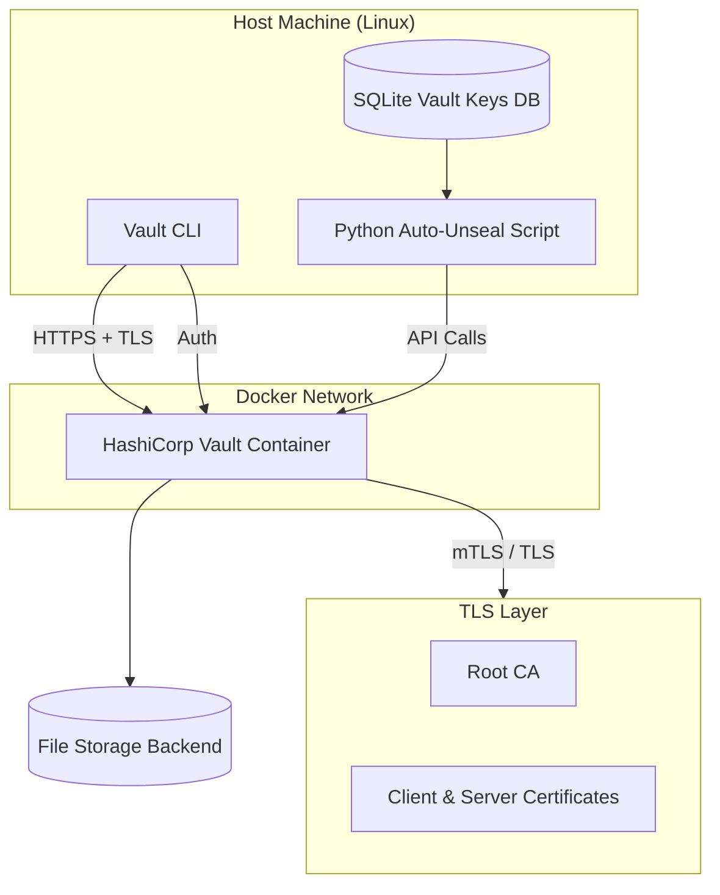

# HashiCorp Vault – Docker TLS Setup Guide


This document provides a step-by-step guide to deploying a self-hosted **HashiCorp Vault** instance using Docker with **TLS enabled**, along with initialization, auto-unseal scripting, and certificate-based authentication.

---

# 📚 Table of Contents

- [Overview](#-overview)
- [Architecture](#-production-architecture)
- [Prerequisites](#-prerequisites)
- [Vault Configuration](#-tls-configuration)
- [Docker Deployment](#-docker-deployment)
- [Vault CLI Setup](#-vault-cli-setup)
- [Environment Setup](#-environment-setup)
- [Initialization & Unseal](#-initialization--unseal)
- [Automated Unseal](#-automated-unseal)
- [Authentication](#-authentication)
- [Policies](#-policies)
- [Utilities](#-utilities)
- [Security Considerations](#-security-considerations)
- [Troubleshooting](#-troubleshooting)

---

# 📌 Overview

This setup includes:

* Vault server running in Docker
* TLS-secured communication (HTTPS)
* File-based storage backend
* Automated unsealing using Python + SQLite
* Certificate-based authentication
* Policy-based access control
* Utility scripts for secrets management

---

# 🏗️ Production Architecture


---

# ⚙️ Prerequisites

Ensure the following are installed on the host machine:

* Docker & Docker Compose
* Python 3.x

  * `requests`
  * `sqlite3` (built-in)
* Linux / WSL / macOS
* CLI tools:
  * `curl`
  * `jq`
  * `unzip`
---

# 🔐 TLS Configuration

## Vault Configuration File

Create the Vault configuration file:

```bash
/opt/data/docker/hsvault/config/config.hcl
```

### `config.hcl`

```hcl
storage "file" {
  path = "/vault/file"
}

listener "tcp" {
  address = "0.0.0.0:8200"

  tls_disable   = 0
  tls_cert_file = "/vault/config/vault.crt"
  tls_key_file  = "/vault/config/vault.key"

  tls_disable_client_certs = false
}

api_addr     = "https://127.0.0.1:8200"
cluster_addr = "https://127.0.0.1:8201"
ui           = true
```

### ⚠️ Notes

* Ensure the following files exist in `/opt/data/docker/hsvault/config/`:

  * `vault.crt`
  * `vault.key`
  * `ca.crt`
* These certificates are required for TLS communication and client trust.

---

# 🐳 Docker Deployment

## Docker Compose Configuration

```yaml
services:
  vault:
    container_name: hashicorp_vault
    image: hashicorp/vault:1.17

    ports:
      - "8200:8200"
      - "8201:8201"

    environment:
      VAULT_ADDR: "https://127.0.0.1:8200"
      VAULT_CACERT: "/vault/config/ca.crt"

    cap_add:
      - IPC_LOCK

    volumes:
      - /opt/data/docker/hsvault/data:/vault/data:rw
      - /opt/data/docker/hsvault/file:/vault/file:rw
      - /opt/data/docker/hsvault/config:/vault/config:rw

    command: vault server -config=/vault/config/config.hcl
    restart: always
```

## Start Vault

```bash
docker compose up -d   # Docker Compose v2
# or
docker-compose up -d   # Legacy
```

---

# 🧰 Vault CLI Setup

```bash
curl -O https://releases.hashicorp.com/vault/1.20.0/vault_1.20.0_linux_amd64.zip
unzip vault_1.20.0_linux_amd64.zip
sudo mv vault /usr/local/bin/

vault version
```

Expected output:

```
Vault v1.20.0
```

---

# 🌐 Environment Setup

```bash
echo 'export VAULT_ADDR="https://localhost:8200"' >> ~/.bash_profile
echo 'export VAULT_CACERT="/opt/homelab/ssl/ca.crt"' >> ~/.bash_profile
source ~/.bash_profile
```

---

# 🔐 Initialization & Unseal

## Initialize Vault

```bash
vault operator init
```

> ⚠️ Store unseal keys and root token securely.

---

## Manual Unseal

```bash
vault operator unseal <key_1>
vault operator unseal <key_2>
vault operator unseal <key_3>
```

Repeat until threshold is met.
Check status:

```bash
vault status
```

---

# 🤖 Automated Unseal

## SQLite Key Store

```python
import sqlite3

def create_sample_db():
    conn = sqlite3.connect('./db_files/vault_key.db')
    cursor = conn.cursor()

    cursor.execute('''
        CREATE TABLE IF NOT EXISTS vaultkeys (
            id INTEGER PRIMARY KEY,
            attribute TEXT NOT NULL,
            key TEXT NOT NULL
        )
    ''')

    keys = [
        (1, 'unseal_key_1', '***'),
        (2, 'unseal_key_2', '***'),
        (3, 'unseal_key_3', '***'),
        (4, 'unseal_key_4', '***'),
        (5, 'unseal_key_5', '***'),
        (6, 'root_token', 'hvs.***')
    ]

    cursor.executemany('INSERT INTO vaultkeys VALUES (?,?,?)', keys)
    conn.commit()
    conn.close()

create_sample_db()
```

---

## Python Auto-Unseal Script

- Reads keys from SQLite
- Calls Vault API
- Tracks seal status

```python
# vault-unseal.py
import requests
import sqlite3
import time

VAULT_ADDR = "https://127.0.0.1:8200"
CA_CERT = "/opt/homelab/ssl/ca.crt"

def get_keys():
    conn = sqlite3.connect('/opt/homelab/utilities/vault/db/vault_key.db')
    cursor = conn.cursor()
    cursor.execute("SELECT key FROM vaultkeys WHERE attribute LIKE '%unseal%'")
    keys = [row[0] for row in cursor.fetchall()]
    conn.close()
    return keys

def unseal():
    url = f"{VAULT_ADDR}/v1/sys/unseal"
    for key in get_keys():
        r = requests.put(url, json={"key": key}, verify=CA_CERT)
        data = r.json()
        print(f"Progress: {data.get('progress')}/{data.get('t')}")
        if not data.get("sealed"):
            print("Vault unsealed successfully")
            return

if __name__ == "__main__":
    unseal()
```

---

## Cron Automation

```bash
@reboot python /opt/homelab/utilities/vault/vault-unseal.py >> /opt/homelab/logs/vault-unseal.log
```

---

# 🔑 Authentication

## Login

```bash
vault login <root-token>
```

---

## Enable Certificate Auth

```bash
vault auth enable cert
```

---

## Configure Certificate Role

```bash
vault write auth/cert/certs/homelab-role \
    certificate=@/opt/homelab/ssl/ca.crt \
    display_name="homelab-client" \
    policies="default" \
    token_ttl=1h \
    token_max_ttl=4h
```

---

## Generate Login Token

### cURL

```bash
curl --request POST \
  --cacert /opt/homelab/ssl/ca.crt \
  --cert /opt/homelab/ssl/client.crt \
  --key /opt/homelab/ssl/client.key \
  https://127.0.0.1:8200/v1/auth/cert/login
```

### Vault CLI

```bash
vault login -method=cert \
  -client-cert=client.crt \
  -client-key=client.key \
  name=homelab-role
```

---

# 📜 Policies

## Create Policy

```bash
cat <<EOF > homelab-policy.hcl
path "secret/*" {
  capabilities = ["read", "list"]
}

path "secret/policy/*" {
  capabilities = ["read", "list"]
}

path "secret/policy/homelab-internal/*" {
  capabilities = ["create", "read", "update", "delete", "list"]
}
EOF
```

Apply:

```bash
vault policy write homelab-policy homelab-policy.hcl
```

Attach to role:

```bash
vault write auth/cert/certs/homelab-role \
    certificate=@/opt/homelab/ssl/ca.crt \
    policies="default,homelab-policy"
```

---

# 🧪 Utilities

## Get Vault Token

```bash
# get-vault-token.sh

#!/bin/bash

COMMON_SSL_DIR="/opt/homelab/ssl"
VAULT_URL="https://localhost:8200"

while [[ -z $VAULT_TOKEN || $VAULT_TOKEN == "null" ]]; do
  VAULT_TOKEN=$(curl -sk --cert ${COMMON_SSL_DIR}/vault_client.crt \
    --key ${COMMON_SSL_DIR}/vault_client.key \
    ${VAULT_URL}/v1/auth/cert/login | jq -r '.auth.client_token')

  sleep 2
done

echo "$VAULT_TOKEN"
```

---

## Create Secret

```bash
# create-vault-secret.sh

#!/bin/bash

alias=$1
key=$2
value=$3
last_updated_time=$(date +%s%3N)

CA_CERT='/opt/homelab/ssl/ca.crt'
export VAULT_TOKEN=$(/opt/homelab/ansible_project/scripts/get-vault-token.sh)
export VAULT_URL="https://localhost:8200"

# Construct JSON payload safely
# Note: Using double quotes for the whole string so variables expand
PAYLOAD=$(cat <<EOF
{
  "alias": "$alias",
  "key": "$key",
  "value": "$value",
  "lastupdatedtime": "$last_updated_time"
}
EOF
)

# Create vault entry (Added /data/ to path for KV-V2)
curl --cacert "$CA_CERT" \
     --header "X-Vault-Token: $VAULT_TOKEN" \
     --request POST \
     --data "$PAYLOAD" \
     "${VAULT_URL}/v1/secret/policy/homelab-internal/${alias}"

# Revoke token
curl --cacert "${CA_CERT}" \
     -H "X-Vault-Token: $VAULT_TOKEN" \
     -X POST "${VAULT_URL}/v1/auth/token/revoke-self"

# Clear Vault token
export VAULT_TOKEN=""
```
---

## Retrieve Secret

```bash
# get-vault-secret.sh

#!/bin/bash

alias=$1

CA_CERT='/opt/homelab/ssl/ca.crt'
export VAULT_TOKEN=$(/opt/homelab/ansible_project/scripts/get-vault-token.sh)
export VAULT_URL="https://localhost:8200"

# Create vault entry (Added /data/ to path for KV-V2)
curl -s --cacert "$CA_CERT" \
     --header "X-Vault-Token: $VAULT_TOKEN" \
     --request GET \
     "${VAULT_URL}/v1/secret/policy/homelab-internal/${alias}" | jq

# Revoke token
curl --cacert "${CA_CERT}" \
     -H "X-Vault-Token: $VAULT_TOKEN" \
     -X POST "${VAULT_URL}/v1/auth/token/revoke-self"

# Clear Vault token
export VAULT_TOKEN=""
```
---

# 🔐 Security Considerations

* Never store unseal keys in plain SQLite in production
* Prefer auto-unseal via cloud KMS (AWS/GCP/Azure)
* Restrict TLS private key permissions
* Rotate root tokens immediately after setup
* Avoid long-lived tokens in scripts

---

# 🧾 Troubleshooting

| Issue              | Cause                  | Fix               |
| ------------------ | ---------------------- | ----------------- |
| Vault sealed       | Not enough unseal keys | Run unseal again  |
| TLS error          | Invalid cert           | Verify CA chain   |
| Connection refused | Vault not running      | Check Docker logs |

---

# 📌 Summary

This setup provides a **fully containerized, TLS-secured Vault environment** with:

* Manual + automated unsealing
* Certificate-based authentication
* Scriptable secrets management
* Policy-driven access control